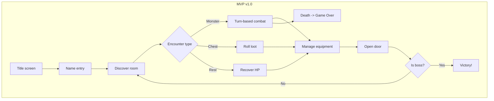

# Roadmap

## Vision Statement

> A turn-based RPG in the terminal where the player must escape a monster-filled
> dungeon. Each encounter brings upgrades (gear, levels, gold).

| Aspect | Definition |
|---|---|
| Setting | Medieval fantasy |
| Structure | Single linear level (cell -> exit), 5-8 rooms |
| Duration | 30-60 min per run |
| Difficulty | Punitive (permadeath), approachable UX |
| Combat | Turn-based (Pokemon-like menu) |
| Target player | A non-technical friend unfamiliar with terminal games |
| Platform | Terminal (ncurses) |

---

## Workshop Artifacts

### Backbone (User Activities)

1. **Start game** -- Title screen, new game, character naming
2. **Discover room** -- Room type + narrative description
3. **Resolve encounter** -- Fight / chest / rest
4. **Manage equipment** -- Inventory, equip/use items (after encounter, before door)
5. **Open door** -- Transition to next room (triggers next encounter)
6. **Reach exit** -- Defeat boss in final room -> escape
7. **End game** -- Victory or death screen -> restart

---

## Release Plan

### MVP v1.0 -- Playable from start to finish

```
Title -> Name -> Room x 5-8 -> Boss -> Victory
```

| Activity | Tasks |
|---|---|
| **Start** | Title screen, new game, enter name |
| **Discover** | Show "Room N -- Type" + description |
| **Combat** | Attack / Use potion. See agents/combat.md for rules. |
| **Chest** | Open -> random loot (weapon, armor, potion) |
| **Rest** | Empty room -> recover HP |
| **Equipment** | View equipped gear (weapon + armor), use potions |
| **Door** | Opens after encounter resolution + equipment management |
| **Exit** | Boss in final room |
| **End** | Victory or death screen -> new game |

### Post-MVP

| Feature | Release |
|---|---|
| Shop (gold, buy/sell) | v1.1 |
| Magic (spells in chests, mana) | v1.1 |
| Class selection at start | v1.1 |
| Monster variety + behaviors | v1.2 |
| Narrative door transitions | v1.2 |
| End-game statistics | v1.2 |
| Rich room descriptions | v2.0 |
| ncurses visual effects (color, animations) | v2.0 |

---

## Architecture (Code Map)

| Module | File | Status |
|---|---|---|
| Game loop | `src/main.c` | Rewrite needed |
| Combat system | `src/combat.c` + `src/combat.h` | Create |
| Equipment (weapon, armor slots) | `src/entity.h` | Extend |
| Loot tables | `src/dungeon.c` | Extend |
| Room descriptions | `src/dungeon.c` | Fix (uninit pointer) |
| Bestiary | `src/bestiary.c` + `src/bestiary.h` | Create |
| ncurses UI | `src/ui.c` + `src/ui.h` | Create |

---

## Flow Diagram



# Current progress

## Phase 1 — Dungeon & Items ✅

- [x] Dungeon rooms and navigation graph
- [x] Item management (pick up, inventory, weight)
- [x] Dice rolling with function pointer injection
- [x] Entity with health, strength, dexterity

## Phase 2 — Equipment & Combat ✅

- [x] Polymorphic items (enum + union for weapon/armor/generic)
- [x] Equipment slots (weapon, armor) on entity
- [x] Armor damage reduction in `entity_take_damage`
- [x] `entity_attack` reads from equipped weapon slot
- [x] Accuracy (1d20 + dex), natural 20 = critical hit
- [x] `combat_turn_order` based on dexterity

## Phase 3 — Bestiary & Combat Loop

- [ ] Monster factory (Rat, Goblin, Guard, Boss) from stat table
- [ ] `combat_encounter()` — full turn-based fight to the death
- [ ] Equip/unequip: move items between inventory and slots

## Phase 4 — Items & Exploration

- [ ] Potion usage (heal entity from inventory)
- [ ] Rest rooms (heal between fights)
- [ ] Victory screen, game-over screen

## Phase 5 — Spells & Polish

- [ ] Player spells (sortilege system)
- [ ] Flee mechanic
- [ ] ncurses UI refinements
